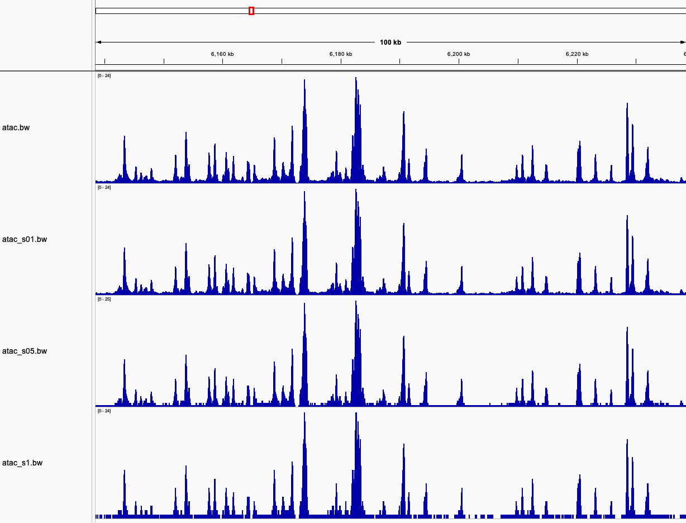
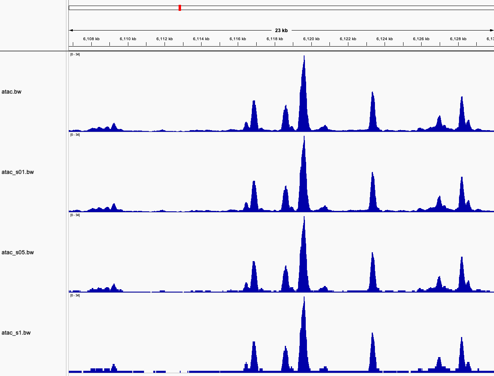
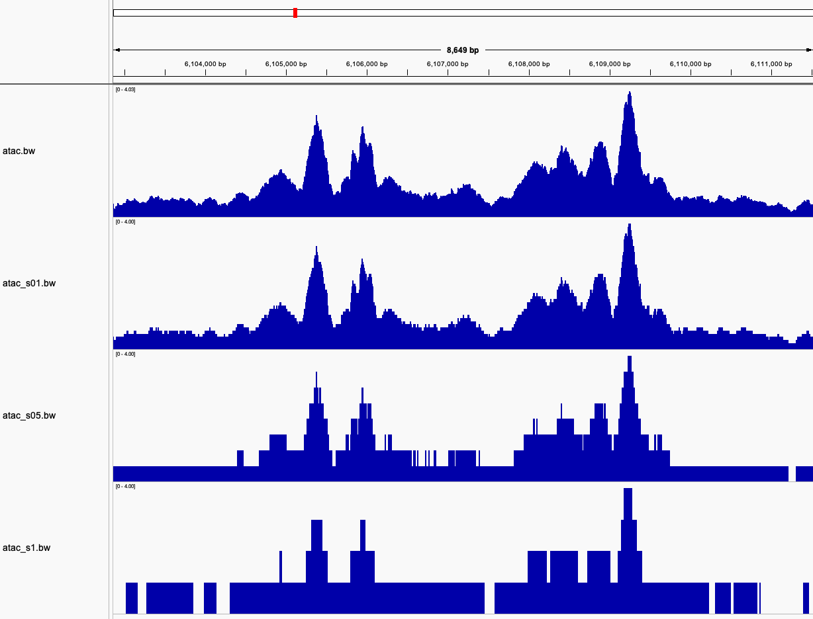

# bwtk: A bigWig Toolkit

bwtk is a program containing a set of utilities for handling [bigWig](https://genome.ucsc.edu/goldenpath/help/bigWig.html)
files, as well as converting to and from the bedGraph format. bigWig files
are indexed binary files which allow for fast read access of different
parts of the file, ideal for genome browsers and extracting data from specific
chromosomes or subsequences quickly. It has some limitations however, such as
only being able to work with genomes that don't contain any individual
chromosome larger than the size limit of `uint32_t` (around 4.2 billion).
This program is built upon the
[libBigWig](https://github.com/dpryan79/libBigWig) library to read and write
bigWigs. One note of caution regarding bwtk's usage of this library: during the
final stages of creating new bigWigs, an indexing step occurs which can require
a very large amount of memory (on the order of hundreds of MBs, perhaps even
GBs of memory for larger files). Therefore, expect any subcommand which involves creating new bigWig files to take up a decent chunk of memory. bwtk is otherwise a fairly lightweight and fast program, needing only a few MBs of memory for the remaining subcommands.

bwtk mostly reimplements some of the existing functionality from the original UCSC tools, with a few additions and improvements:

- bedGraph files can be gzipped when converting to bigWig
- Multiple bigWigs can be averaged/summed/min'd/max'd together
- Retrieval of single-base resolution data from BED ranges
- Subsetting of bigWigs
- Value operations such as addition, multiplication, log10 transformation
- Binning of bigWig values and collapsing of any resulting sequential ranges with identical values, leading to substantially smaller file sizes depending on the bin step value

## Installation

```sh
make libz libBigWig
make release
```

## Quick start

### File transformations

- `bg2bw`: one bedGraph -> [optional operation] -> one bigWig
- `adjust`: one bigWig -> [optional operation] -> one bigWig (or bedGraph)
- `merge`: Multiple bigWigs -> [merge values] -> [optional operation] -> one bigWig

### Data extraction

- `values`: Extract single base-resolution range scores
- `score`: Calculate summary information of range scores
- `chroms`: Retrieve chromosome names and sizes

## Example usage: converting a bedGraph and reducing the file size

Let us consider a theoretical Arabidopsis ATAC-seq sample, starting from a compressed bedGraph:

```
$ du -h atac.bedGraph.gz
382M    atac.bedGraph.gz
```

To start, we can first convert to bigWig.

```sh
$ bwtk bg2bw -i atac.bedGraph.gz -g chrom.sizes -o atac.bw
$ du -h atac*
382M    atac.bedGraph.gz
328M    atac.bw
```

382 MB is a fairly typical size for an Arabidopsis genome-wide compressed bedGraph file, if perhaps on the larger side. Converting to bigWig doesn't give us much space savings, but it does make loading into IGV and other applications must faster. However there is a trick we can use to substantially reduce the file size: binning.

First, let's get an idea of the basic properties of the data by getting some chromosome-level statistics:

```sh
$ bwtk score -i atac.bw -o-
name	size	covered	sum	mean0	mean	min	max
1	30427671	28792570	3.97622e+07	1.30678	1.38099	0.006472	43.6019
2	19698289	19260767	2.35234e+07	1.19419	1.22131	0.006472	44.2038
3	23459830	22963063	2.96944e+07	1.26576	1.29314	0.006472	40.5665
4	18585056	18154827	2.34319e+07	1.26079	1.29067	0.006472	40.7154
5	26975502	26081099	3.45877e+07	1.28219	1.32616	0.006472	42.9223
Mt	366924	0	0	0	0	0	0
Pt	154478	0	0	0	0	0	0
```

From these results, we can make a couple of guesses: the background signal is likely around 1, and the values in peak regions ranges from 1 to 40. We first try using a very rough binning, such as rounding to the nearest integer:

```sh
$ bwtk adjust -i atac.bw -s 1 -o atac.s1.bw
$ du -h atac*
382M    atac.bedGraph.gz
328M    atac.bw
8.7M    atac.s1.bw
```

As you can see, this give us an impressive 37X size reduction over the original bigWig! However, rounding to the nearest integer may not be giving us sufficient resolution. Before we check how it looks in a genome browser, we can try a couple of smaller bin sizes:

```sh
$ bw adjust -i atac.bw -s 0.5 -o atac.s05.bw
$ bw adjust -i atac.bw -s 0.1 -o atac.s01.bw
$ du -h atac*
382M    atac.bedGraph.gz
328M    atac.bw
59M     atac_s01.bw
14M     atac_s05.bw
8.7M    atac_s1.bw
```

Obviously, using smaller bin sizes gives us larger bigWigs. Still, we get an over 5X size reduction for our smallest bin size. But let's compare:



Zooming out to a 100 kb view, we can see all of the peaks are still distinct at all bin sizes. However, there is clear strong blockiness at the coarsest bin size of 1 which is rather visually unappealing. Things look a bit better at 0.5. Let's try zooming in a bit more:



The bin size of 0.5 still looks quite good considering the 23X size reduction! However, there is a little bit of blockiness in the peak shapes. The bin size of 0.1 on the other hand is still nearly indistinguishable from the original track. Let's zoom in once more:



Now, in this very close up shot of some very small peaks we can finally see the blockiness effect of the smallest bin size, though we can still see all of the peak shape details! Obviously the decision of which bin size to use will depend on the distribution of values in the bigWig, as well as the desired scale we would like to visualize the data.

